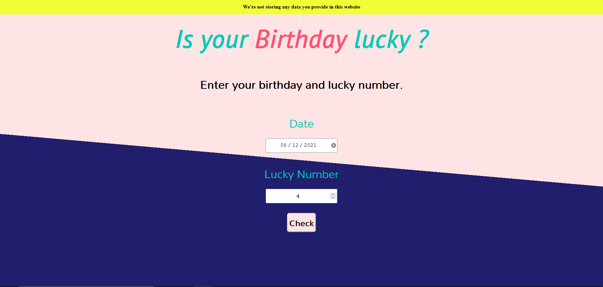
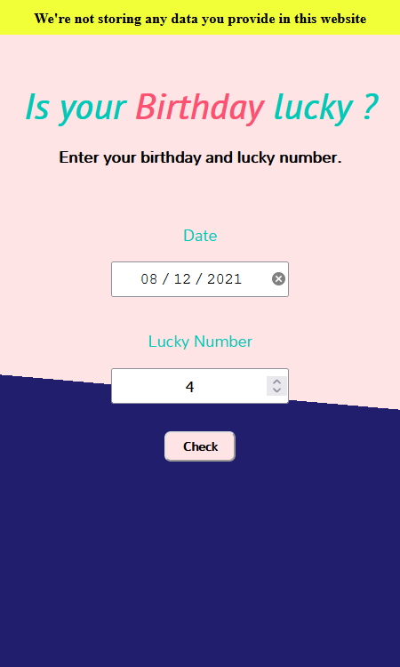

## ✨ About 

Enter your birthdate and your lucky number and the app will check if your birthdate is lucky or not.

-> Takes input of birthdate from user.  
-> Takes input of lucky number from user.  
-> Some calculations at backend.  
-> Display result.  

## 😉 **Glimpses**

&nbsp; &nbsp; &nbsp; &nbsp; 

## 👉 Check here [Live](https://dcs-lucky-birthday.netlify.app/)

## 💻 **Built with**

 &nbsp;  &nbsp;   &nbsp;  

